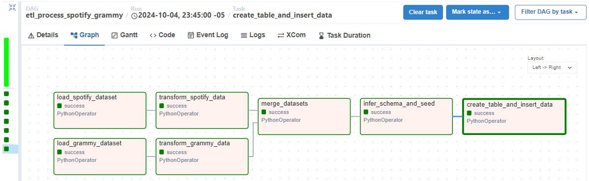

# Workshop002_spotify_grammy

This project consists of building an ETL pipeline using Apache Airflow 🚀. The goal is to extract data from a database, perform transformations on it 🔄, and ultimately create a dashboard visualizing the information from the database 📊.

For this challenge, we will work with specific datasets: one from Spotify 🎶 with audio characteristics and another from the Grammy Awards 🏆. Skills in using technologies such as Python 🐍, Apache Airflow, and visualization tools like Looker will be evaluated. The focus is on ensuring that the entire ETL process is managed correctly and that reports come from the final database, not the original files.

---

## Exploratory Data Analysis - Spotify

The exploratory analysis of the Spotify dataset revealed relevant information about the structure and quality of the data. The dataset contains **114,000 rows** and multiple columns covering numerical, categorical, and boolean features. During the process, it was verified that the **'Unnamed: 0'** column meets the criteria to be used as a primary key, ensuring the uniqueness of the records 🔑.

Several peculiarities were identified, such as the repetition of values in the **track_id** column, where the only variation corresponds to the assigned **genre**, reflecting Spotify's algorithm classification. Additionally, **albums with identical names but different artists** were detected, indicating possible versions or variations of the same works 🎤.

In terms of data quality, outliers were observed in columns like **time_signature**, where some records showed signatures of 0/4, which is musically nonsensical. It was also recommended to remove the **track_genre** column since its information is redundant and adds little value to the analysis ❌.

Finally, categorical columns like **key_column** and **time_signature**, although they have numerical values, should be treated as categorical variables. The analysis concluded that the dataset has good potential for deeper future transformations, although some inconsistencies will need to be resolved during the cleaning process 🧹.

## Explanation of the DataFrame Columns

1. **Unnamed: 0 (🔢)**
    - **Description:** Auto-incremental column that guarantees uniqueness.
    - **Data Type:** Integer.
    - **Unique Values:** True.
    - **Notes:** Candidate for primary key due to its unique and sequential property.
  
2. **Track ID (🎫)**
    - **Description:** Unique identifier for each song on Spotify.
    - **Data Type:** String.
    - **Unique Values:** False.
    - **Notes:** Contains duplicates with minimal differences in genre.
  
3. **Artists (🎤)**
    - **Description:** Names of the artists performing the songs.
    - **Data Type:** String.
    - **Unique Values:** False.
    - **Notes:** Includes 31,437 artists, with **The Beatles** appearing 279 times.
  
4. **Album Name (💿)**
    - **Description:** Name of the album where each track appears.
    - **Data Type:** String.
    - **Unique Values:** False.
    - **Notes:** 46,589 unique albums; "Alternative Christmas 2022" appears 195 times.
  
5. **Track Name (🎵)**
    - **Description:** Name of the song.
    - **Data Type:** String.
    - **Unique Values:** False.
    - **Notes:** 73,608 unique names.
  
6. **Explicit Column (🚫)**
    - **Description:** Indicates whether a song contains explicit lyrics.
    - **Data Type:** Boolean.
    - **Unique Values:** False.
    - **Notes:** 91.4% of the songs are not explicit.
  
7. **Key Column (🎹)**
    - **Description:** Tonality of the song according to standard notation.
    - **Data Type:** Integer - Categorical.
    - **Unique Values:** False.
    - **Notes:** 12 distinct tonalities, with the most common being **7** (13,245 times).
  
8. **Time Signature (⏱️)**
    - **Description:** Indicates the meter of the song (number of beats per measure).
    - **Data Type:** Integer - Categorical.
    - **Unique Values:** False.
    - **Notes:** The most common is **4/4** (101,843 songs).
  
9. **Mode (🎛️)**
    - **Description:** Indicates whether the song is in a major or minor mode.
    - **Data Type:** Boolean.
    - **Unique Values:** False.
    - **Notes:** 63.8% of the songs are in major mode.
  
10. **Track Genre (🎧)**
    - **Description:** Genre to which each song belongs.
    - **Data Type:** String.
    - **Unique Values:** False.
    - **Notes:** 114 genres, each associated with 1,000 songs.
  
11. **Energy (🔋)**
    - **Description:** Energy level of the song (0 to 1).
    - **Data Type:** Float.
    - **Notes:** Average of 0.64, indicating moderately energetic songs.
  
12. **Danceability (💃)**
    - **Description:** Measure of how danceable a song is.
    - **Data Type:** Float.
    - **Notes:** Average of 0.58, indicating that the songs are relatively danceable.
  
13. **Duration_ms (⏲️)**
    - **Description:** Duration of the track in milliseconds.
    - **Data Type:** Integer.
    - **Notes:** Average of 212,906 ms (3.54 minutes).
  
14. **Popularity (🎯)**
    - **Description:** Popularity of the song on a scale from 0 to 100.
    - **Data Type:** Integer.
    - **Notes:** Average of 35, indicating that the songs are not very well-known.
  
15. **Loudness (🔊)**
    - **Description:** Overall volume of the song in decibels (dB).
    - **Data Type:** Float.
    - **Notes:** Average of -7 dB, quieter than average.
  
16. **Speechiness (🗣️)**
    - **Description:** Proportion of spoken words in the song.
    - **Data Type:** Float.
    - **Notes:** Average of 0.048, indicating that most are primarily sung.
  
17. **Acousticness (🌲)**
    - **Description:** Confidence that the track is acoustic.
    - **Data Type:** Float.
    - **Notes:** Average of 0.16, suggesting a trend towards synthesized sounds.
  
18. **Instrumentalness (🎻)**
    - **Description:** Probability that the track contains no vocals.
    - **Data Type:** Float.
    - **Notes:** Average close to 0, indicating that 99% have vocal content.
  
19. **Liveness (🎤)**
    - **Description:** Detects if the track was recorded live.
    - **Data Type:** Float.
    - **Notes:** Average of 0.13, indicating a low likelihood of live recordings.
  
20. **Valence (😊)**
    - **Description:** Level of perceived positivity in the song.
    - **Data Type:** Float.
    - **Notes:** Average of 0.46, suggesting a mix of emotions in the songs.
  
21. **Tempo (🔄)**
    - **Description:** Speed of the song in beats per minute (BPM).
    - **Data Type:** Float.
    - **Notes:** Average of 122 BPM, indicating a preference for danceable songs.

---

## Exploratory Data Analysis - Grammy

The analysis of the Grammy Awards dataset revealed relevant information about the structure and quality of the data. The dataset contains **4,810 records** and **10 columns** detailing information about artists, categories, and historical trends. An exponential growth in nominations was observed starting in **2019**, driven by a rule change that increased the number of nominees per category from **5 to 8** 🆙.

Inconsistencies were identified in the **winners** column, where all records appear marked as winners, suggesting errors in the data extraction 🔍. Additionally, artists and albums were found to be nominated in multiple years or in multiple categories in a single edition, reflecting the diversity and repetition of some participants 🎶.

The analysis highlighted a decrease in the number of categories in **2011**, due to the elimination of several of them. This decision was made as part of a review of the event structure, which limited recognition opportunities in a widely followed event.

---
## Column Explanations of the DataFrame

1. **Artist 🎤**
    - **Description:** Name of the nominated artist.
    - **Data Type:** String
    - **Notes:** Found 3,152 duplicate values and 1,840 missing values. The most frequent value is "(Various Artists)", which appears 66 times.
  
2. **Category 🏆**
    - **Description:** Category in which the artist is nominated.
    - **Data Type:** String
    - **Notes:** The most frequent category is "Song of the Year," with 70 occurrences. There are no missing or duplicate values.
  
3. **Img 🖼️**
    - **Description:** Link to the image of the artist or nominee.
    - **Data Type:** String
    - **Notes:** Found 1,367 missing values. The most repeated image is of John Williams, which appears 26 times.
  
4. **Nominee 👤**
    - **Description:** Name of the nominee.
    - **Data Type:** String
    - **Notes:** Found 679 duplicate values and 6 missing values. The most repeated nominee is "Robert Woods," with 7 occurrences.
  
5. **Published At 📅**
    - **Description:** Date and time when the nomination was published.
    - **Data Type:** String
    - **Notes:** There are no missing values. The most frequent value is "2017-11-28T00:03:45-08:00," which appears 4,205 times.
  
6. **Title 🎬**
    - **Description:** Title of the Grammy Awards ceremony.
    - **Data Type:** String
    - **Notes:** There are no missing or duplicate values. The most frequent title is "62nd Annual Grammy Awards (2019)," with 433 occurrences.
  
7. **Updated At ⏰**
    - **Description:** Date and time of the last update of the nomination.
    - **Data Type:** String
    - **Notes:** There are no missing or duplicate values. The most repeated value is "2019-09-10T01:08:19-07:00," with 778 occurrences.
  
8. **Winner 🏅**
    - **Description:** Indicates whether the nominee won the award.
    - **Data Type:** Boolean
    - **Notes:** All values are "True," indicating that all nominees in the file are winners.
  
9. **Workers 🧑‍💼**
    - **Description:** Names of the people who worked on the nomination.
    - **Data Type:** String
    - **Notes:** Found 2,190 missing values. The most repeated value is "John Williams, composer (John Williams)," with 20 occurrences.
  
10. **Year 📅**
    - **Description:** Year of the Grammy Awards ceremony.
    - **Data Type:** Integer
    - **Notes:** There are no missing or duplicate values. The most repeated year is 2019, with 433 occurrences.

---

## Extraction, Transformation, and Loading (ETL) of the datasets

## ETL Spotify

The ETL (Extraction, Transformation, and Loading) process for the Spotify dataset is implemented in the `EtlSpotifyAirflow` class. Initially, an instance of the class is created that accepts a pandas DataFrame as input, representing the Spotify data. Data cleaning is carried out in several stages, starting with cleaning specific columns such as 'artists', 'album_name', and 'track_name'. In the `clean_column` method, null values are filled with empty strings, whitespace is removed, all characters are converted to lowercase, and accented characters are eliminated using the `unidecode` function. Additionally, any resulting empty string is replaced with a null value.

Subsequently, duplicates are removed based on the 'track_id' column using the `remove_duplicates` method, which allows specifying whether to keep the first, the last, or to remove all duplicates. To ensure data integrity, a filter is applied in the `filter_time_signature` method to retain only records where the `time_signature` is not zero and `duration_ms` is greater than zero, which helps eliminate invalid records. Finally, the `run_etl` method coordinates the entire process, invoking the cleaning, duplicate removal, and filtering methods, returning a clean Spotify DataFrame ready for further analysis or loading into a target system.

---

## ETL Grammy

The ETL (Extraction, Transformation, and Loading) process for the Grammy awards dataset is implemented in the `EtlGrammyAirflow` class. This class accepts a pandas DataFrame containing Grammy information. The process starts by simplifying the award titles in the 'title' column, where a regular expression is used to identify and modify the annual Grammy titles, streamlining them into a more straightforward and clear format.

Next, the first winner is marked in the 'winner' column using the `mark_winner` method, which groups the data by year and category, setting the first record as true and the others as false. To extract the artist's name from the 'workers' column, the `extract_artist_from_workers` method is applied, which uses regular expressions to identify the artist's name within parentheses and assigns it to the 'artist' column. If the 'artist' field remains null after this extraction, it is filled with the value from the 'nominee' column via the `fill_missing_artists` method.

Subsequently, records where the 'artist' column is null are removed using the `remove_null_artists` method, ensuring that all records in the DataFrame have a valid artist. Then, cleaning is performed on the 'category', 'artist', and 'nominee' columns to remove whitespace, convert everything to lowercase, and eliminate accents using the `unidecode` function. Finally, award categories are filtered to include only those that contain specific keywords like 'album', 'song', and 'artist', using the `filter_categories` method.

The `run_etl` method coordinates this entire process, invoking each of the previous methods and ensuring that the Grammy dataset is clean and ready for analysis. At the end of the process, a confirmation message is printed, and the transformed DataFrame is returned.

---

## Merging the datasets

The `EtlGrammySpotifyMerge` class is responsible for merging data from two sources: the Grammy awards and Spotify. Initially, it is initialized with two DataFrames, one containing Grammy data and the other with Spotify data, along with a path to save the final file.

The first method, `merge_albums`, performs a merge of the album data, using an outer join to retain all records. Artist and album names are compared, adding a column that indicates whether an album was nominated for a Grammy. Albums that are only in Spotify are also filtered, showing how many records do not have a nomination.

Next, the `merge_songs` method carries out a similar task, but this time merging the song data based on the names of the artists and the songs. As in the case of albums, it marks whether the songs have Grammy nominations and counts those that are exclusively on Spotify.

After merging the album and song data, the `combine_data` method combines both sets, removing duplicates and providing a unique DataFrame.

Finally, the `save_combined_data` method saves the combined DataFrame to an Excel file at the specified path, creating the folder if it does not exist. The `run_merge` method coordinates the entire process, executing the merges of albums and songs, combining the results, and saving the final file.

---

## Integration with Apache Airflow

The defined DAG manages the ETL process for the Spotify and Grammy datasets. First, the Spotify dataset is loaded from a PostgreSQL database, which is stored in a DataFrame and sent to XCom for later use. Similarly, the Grammy dataset is loaded, which is also stored in a DataFrame and sent to XCom.

Once both datasets are available in XCom, the transformation process for the Spotify dataset begins using the `EtlSpotifyAirflow` class, which utilizes the loaded data to execute its ETL logic. This process is followed by the transformation of the Grammy dataset using the `EtlGrammyAirflow` class, which also operates on the previously loaded DataFrame.

Then, the merging of both datasets takes place through the `EtlGrammySpotifyMerge` class, which combines the DataFrames and sends the result to XCom. After the merge, the schema of the new combined table is inferred, and SQL seed scripts are generated using the `CreateSchemaSeed` class. These scripts are essential for creating the table in PostgreSQL and for inserting the data.

Finally, the corresponding table is created in the database, and data is inserted using the generated scripts. The structure of the DAG ensures that tasks are performed in the correct order, facilitating data flow and managing dependencies between tasks.

---

## Technologies Used

- **Python** 🐍
- **Apache Airflow** 🌪️
- **PostgreSQL** 🗄️
- **Looker** 📈
- **Pandas** 📊
- **NumPy** 🔢
- **Matplotlib** 📉

---
## How to Clone and Use the Repository? 🛠️

For a correct use it is necessary to follow the following steps:

1. Clone the repository📁 2.
    
    First, clone the repository and navigate to the project directory:
    
    ```bash
    git clone https://github.com/Juananalv205/Workshop002_spotify_grammy.git
    cd Workshop002_spotify_grammy
    
    ```
    
2. **Create a virtual environment 🐍**
    
    Next, create a virtual environment to install the project dependencies:
    
    ```bash
    python -m venv .venv
    source venv/bin/activate # On Windows use ``venv/scripts/activate`.
    ```
    
3. *Install the requirements 📦 **.
    
    Install the required libraries and dependencies from the 'requirements.txt' file:
    
    ```bash
    pip install -r requirements.txt
    ```
    
4. Add environment variables:🔐
    
    Set the environment variables required for the database connection in a `.env` file:
    
    ```bash
    # Database
    DatabaseHost=“***-mysql.services.clever-cloud.com” # The *** must be changed to the respective identifier.
    DatabaseName=“” #Add the database name, not the table name
    DatabaseUser=“” #Add the used user name
    DatabasePassword=“” #Add the password
    DatabasePort=“3306” #This port will always remain while using Mysql
    ```
    

This set of instructions will guide you through the configuration and preparation of the working environment for this project. By following these steps, you will be able to clone, configure and run the code on your local machine.

---
---

## Contributions

Contributions are welcome. Please open an **issue** or submit a **pull request** for any improvements you wish to make 🤝.

---

Thank you for your interest in this project! If you have any questions or suggestions, feel free to reach out. 😊
